<!-- @import "note-style.less" -->

<!-- https://detexify.kirelabs.org/classify.html -->
<!-- https://shd101wyy.github.io/markdown-preview-enhanced/#/ -->

<link href="https://fonts.googleapis.com/css2?family=Handlee&display=swap" rel="stylesheet">

<!--

<table>
  <tr>
    <th></th>
    <th></th>
  </tr>
  <tr>
    <td></td>
    <td></td>
  </tr>
  <tr>
    <td></td>
    <td></td>
  </tr>
</table>

<table>
  <td></td>
  <td></td>
</table>

brute force + list leak

firewall

mettre devant un vpn

art


### Introduction

* Pourquoi avoir un home server?
  * Centralise et fournit un control absolue sur les données et traitements
  * Hybride : peut faire d'autre tâche que son objectif premier
  * Pleine gestion sur la disponibilité du server
  * Gestion des sauvegardes
  * Potentiel maintient de la privacité des données
* Dois-je réellement sécurisé mon home server?
  * Si port forward -> alors oui
* Type de server qui demande à être plus sécuritaire

> Il y a plusieurs façon de sécurisé un home server. Nous couvrirons uniquement ceux que nous jugeons pertinante et intéressante dans le cadre du cours. Aussi, les pratiques mises de l'avant diminue le risque d'intrusion sans pour autant les éliminer à 100%.

> La nonchalance de permettre des connections non autorisés au server n'est pas une mesure de sécurité.

<br>
<br>

### État art

* SSH
  * Permet d'avoir un accès shell crypté au server
* VPN
  * Permet d'avoir accès a un network qui autrement n'aurait pas été possible
* Firewall
* Fail2ban 


<br>
<br>

### Implementation

* SSH
  * 


* SSH + VPN
  * 

> On ne veut pas éviter le problèmes mais le gérer. Ainsi, on à la situation où on concerve uniquement le ssh et l'autre qui à le ssh et le vpn.

> On ne peut pas accepter uniquement la connection provenant de certain ip

> Ne pas exposer le machines ssh directement sur internet


-->

# Home Server

Étienne Gauvin-Clermont (18 094 321)
Michael Labrecque (18 135 643)

<br>

## Mise en situation

De nos jour, il devient de plus en plus intéressant de vouloir ce confectionner un server maison (home server), et ce, pour plusieur raisons. Pour en cité quelques une :


* Centralise et fournit un control absolue sur les données et traitements 
* Hybride : peut faire d'autre tâche que son objectif premier

<block-text> **Exemple** 
Prenons un home server dont son principale objectif est le stockage d'informations. On peut lui demandé parallèlement d'exécuter d'autres tâches. En effet, nous pouvons lui demander par exemple d'encoder des vidéo avec ffmpeg, mettre en place un server pour un jeu, faire de l'interpolation de vidéo avec [RIFE](https://github.com/hzwer/arXiv2020-RIFE).
</block-text>

* Pleine gestion sur la disponibilité du server
* Gestion des sauvegardes
* **Potentiel** maintient de la privacité des données

<br>

Dans la situation où un server est utilisé uniquement à des fins personnel et de façon local, il est tout à fait acceptable de limiter son implication dans le but de sécurer pleinement celui-ci. Toutefois, il peut être intéressant de rendre accessible notre serveur de l'extérieur (remote access). Ainsi, il serait désormais possible de consulter et intéragir avec notre server de n'importe qu'elle endroit. Pour ce faire, il suffit de port forward le server. Une telle configuration est très triviale, mais elle à un problème.

<br>

Le problème c'est que port forward notre server nous rend plus propice aux attaques. Effectivement, rendre notre système interrogable de l'extérieure pour nous le rend aussi pour les autres. Pour cette raison, nous devons mettres certaines concept en place pour limiter le plus possible une future tentative d'intrusion.

> Il y a plusieurs façon de sécurisé un home server. Nous couvrirons uniquement ceux que nous jugeons pertinante et intéressante dans le cadre du cours. Aussi, les pratiques mises de l'avant diminue le risque d'intrusion sans pour autant les éliminer à 100%.

<br>

Ce doument va illustré certaines configurations que nous avons tester et mis en place. D'ailleurs, certaines de ces configuration ont été automatiser dans un projet typescript que nous avons développer et mis disponible sur [GitHub](https://github.com/MYSTACK555/SEC_SEARCH).  

<br>

## Modèle de sécurité

Sachant que notre server peut être accessible ou interrogé par n'importe qui sur internet, nous avons l'obligation de mettre en place certaines mesures de sécurité afin de protéger nos donnés.

<br>

### Activer firewall

**Prérequis**

```shell
sudo apt install ufw
```


Pour activer le firewall, exécuter:

```shell
sudo ufw enable
```

Ensuite, nous devons autoriser le port SSH dans le firewall en exécutant:

```shell
sudo ufw allow 22/tcp 
```

> Il est parfois nécessaire d'incorporer un fichier de configuration dans <po>/etc/ufw/applications.d</po> pour ajouter des régles détaillé.

Exemple de règle pour un [Plex](https://www.plex.tv/en-ca/)

```shell

[plexmediaserver]
title=Plex Media Server (Standard)
description=The Plex Media Server
ports=32400/tcp|3005/tcp|5353/udp|8324/tcp|32410:32414/udp

[plexmediaserver-dlna]
title=Plex Media Server (DLNA)
description=The Plex Media Server (additional DLNA capability only)
ports=1900/udp|32469/tcp

[plexmediaserver-all]
title=Plex Media Server (Standard + DLNA)
description=The Plex Media Server (with additional DLNA capability)
ports=32400/tcp|3005/tcp|5353/udp|8324/tcp|32410:32414/udp|1900/udp|32469/tcp

```

> C'est une bonne pratique de séparer les règles dans plusieurs fichiers. Par exemple, les règles précédante pourrait être contenu dans un fichier <po>PlexMediaServer</po>

Ensuite, il suffit d'activer certaine règle par leur nom. Par exemple:
```shell
sudo allow plexmediaserver-all
```

> Un *reload* est parfois nécessaire pour prendre en considération certaines modifications. `sudo ufw reload`


<br>

### Désactiver le root login

L'une des premières étapes dans la sécurisation d'un serveur est de désactivé l'accès a celui-ci de l'extérieur avec le compte de super utilisateur. Comme l'une des méthodes d'accès via un terminal est SSH, nous devons d'abort désactivé la connection à la machine depuis l'utilisateur root.

<br>

Quelques raisons pour lesquelles il est préférable de désactivé cet utlisateur :
* Il possède énormément trop de droit sur la machine. (Il possède tous les droit)
* Même avec un mot de passe relativement fort il reste vulnérable à une attaque par force brute.

<br>

<block-title>Étapes </block-title>

1. Ouvrir le fichier de configuration sshd_config
  
  ```bash
  nano /etc/ssh/sshd_config
  ```

2. Chercher la ligne **`PermitRootLogin yes`** et remplacer la valeur `yes` par `no`
3. Sauvegarder le fichier
4. Redémarer le service SSH
  
  ```bash
    service ssh restart
  ```

<br>

### Utiliser clef SSH plutôt qu'un mot de passe

Comme nous allons nous connecter à notre serveur exposé depuis un réseaux qui n'est pas sécurisé l'utilisation d'une clé Sécure shell nous permettera de créer une connection sécurisé. La clé SSH utilise de la cryptographie à clé publique. C'est un algorithme composé de deux clés. Une publique mise à la disponibilité de tous et une privé bien garder sur la machine du client qui sert à déchiffrer les messages chiffrés à l'aide de la clé publique correspondante.

<br>

Il existe plusieurs algorithmes permettant de créer une paire de clé SSH :
<table>
  <tr>
    <th></th>
    <th></th>
  </tr>
  <tr>
    <td>DSA</td>
    <td>RSA</td>
    <td>Ed25519</td>
  </tr>
  <tr>
    <td>Dangereux et plus utiliser depuis la version 7.0 de OpenSSH</td>
    <td>Offrant une sécurité acceptable si la longeur de la clé est de 3072 ou 4096 bits</td>
    <td>L'algorithme à prévilégier de nos jours, car actuellement le plus sûr.</td>
  </tr>
</table>

<br>
<br>

L'utilisation d'une phrase secrète pour protéger la clé privé est une excellente façons de s'assuré que nous sommes la seule personne qui puisse l'utiliser principalement si nous ne sommes pas le seul utilisateur de la machine. De plus, cela ajoute une étape supplémentaire à un attaquant qui réussirait à prendre possession de la clé privé puisqu'il devra faire une attaque par force brute afin de trouvé cette phrase avant d'utiliser la clé privé.

<br>

Afin de s'authentifier au serveur avec sa clé ssh, le client procède comme suit:

1. Le client initialise la connection ssh
2. Le serveur génère un message aléatoire <a name="po1"></a>
3. Le client encrypte le message aléatoire avec sa clé privé
4. Le serveur décrypte le message encrypté avec la clé publique du client
5. Dans le cas ou le message décrypté est le même que celui initialement envoyé au client, le serveur envoie une réponse afirmative au client
6. Le client et le serveur s'entende sur l'utilisation d'une clé de session
7. Échange de donné encrypté avec un algorithme symétrique et la clé de session

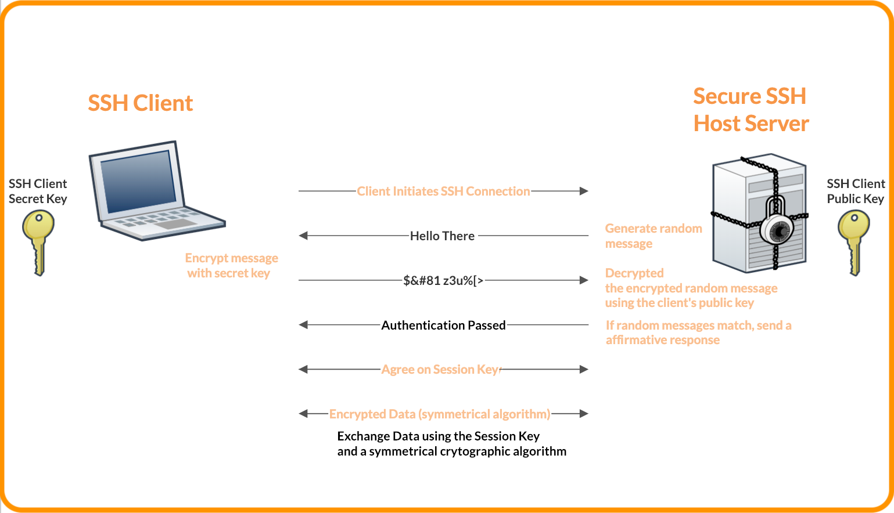

<br>

<block-text> **Étapes** 
Créer clef client
</block-title>

Afin de générer une clé il suffit de procédé comme suit :

1. Ouvrir un terminal
2. Générer la clé avec la commande 
   * Pour Ed25519
    `ssh-keygen -t ed25519`
   * Pour RSA
    `ssh-keygen -t rsa -b 4096`
3. Laisser l'emplacement par défaut
4. Entrez une phrase secrète pour protéger la clé privé


<br>

Cela peut être intéressant d'avoir plusieurs clef ssh, car on peut plus facilement gérer les restrictions et l'utilisation de ceux-ci. En effet, il pourrait arriver la situation où nous voulons désactiver/invalider une certaine clef en plus de savoir exactement quelle clef à été utilisé à quelle moment.

<br>

Pour créer une clef RSA de 4096 bit portant le nom de client, exécuter:
```shell
ssh-keygen -t rsa -b 4096 -f ~/.ssh/client-key
```

> Le nom *client* aurait pu être remplacé par n'importe quoi.

Il sera proposé lors de la création de la clef de fournir un passphrase. Il est fortement conseiller dans fournir un sans quoi seul la possession de la clef privé (client-key) sera nécessaire pour l'authentification.

<br>

Après, le dossier */home/username/.ssh* contient les fichiers suivants :
* client-key
* client-key.pub

<br>

**Résultat**
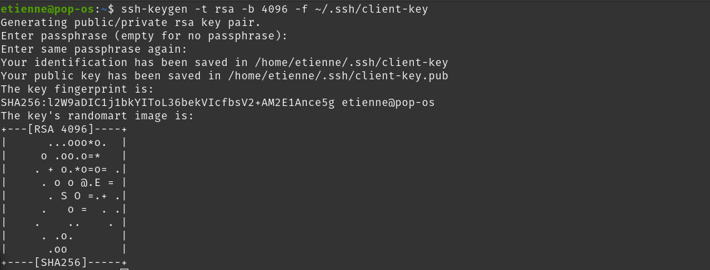

<br>

<block-text> **Étapes** 
Transférer clef client au server
</block-title>

Pour copier la clef public du client vers le server, exécuter:
```shell
cat ~/.ssh/client-key.pub | ssh server_username@server_ip "mkdir -p ~/.ssh && cat >> ~/.ssh/authorized_keys"
```

> Remplacer *server_username* avec le nom du server et remplacer *server_ip* par l'ip du server.

Maintenant, le dossier du server */home/username/.ssh* contient le fichier <po>authorized_keys</po>

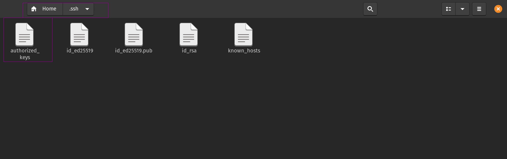

<br>

<block-text> **Étapes** 
Connection au server
</block-title>

Pour ce connecter au server, exécuter:
```shell
ssh -i ~/.ssh/client-key server_username@server_ip
ssh -i ~/.ssh/client-key etienne@10.0.0.33
```

> Remplacer *server_username* avec le nom du server et remplacer *server_ip* par l'ip du server.

Ensuite, il faudra saisir le passphrase entré dans les étapes précédentes.
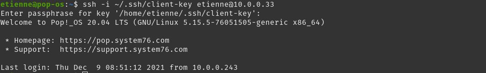

<br>

Toutefois, nous sommes toujours en mesure de ce connecter au server par le biais des informations d'un utilisateurs. En effet, l'ajout d'une clef public au server n'empêche pas automatiquement l'authentification par mot de passe.

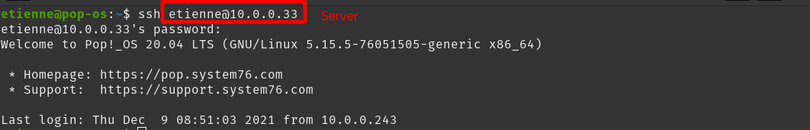


<br>

### Authentification uniquement par la clef SSH </block-title>

Il est maintenant primordiale de vouloir empêcher toute authentification avec le mot de passe de l'utilisateur. Pour refuser une connection ssh utilisant ce principe, il suffit de modifier le fichier <po>/etc/ssh/sshd_config</po> pour y ajouter cette ligne :

```shell
PasswordAuthentication no
```

Ensuite, il sera impossible de ce connecter avec un mot de passe d'utilisateur.

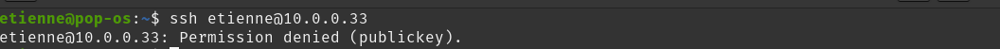

<br>

### Ajouter un système MFA à la connexion SSH


L'utilisation d'un mot de passe ou la clé SSH sont 2 facteur d'authentification différent. Un facteur d'authentification est une information utiliser afin de prouvé que l'utilisateur à le droit d'effectuer des actions sur un système tel que de s'y connecter. Ces facteurs utilisent différent canaux d'authentification tel qu'un ordinateur, un téléphone cellulaire ou une clé physique d'authentification. C'est le média qui sert a transmettre un facteur d'authentification à l'utilisateur. Afin de renforcer la connexion ssh à notre serveur il est une excellente pratique d'appliquer une sécurité supplémentaire par l'utilisation de MFA (Multi-factor authentification). De cet facons, un attaquant qui réussit à compromettre votre ordinateur de bureau doit aussi obtenir le controle d'un ou plusieurs autres appareils vous appartient afin de pouvoir effectuer ses actions malicieuses. Les types de facteurs se catégorise en 3 groupes:

<br>

* Quelque chose que vous connaissez: un mot de passe ou une question de sécurité
* Quelque chose que vous possédez: une application d'authentification ou un token de sécurité.
* Quelque chose que vous êtes: une empreinte digitale, ou la reconnaissance vocale

<br>

L'un des facteur fréquemment utilisé par les différents systèmes est une application OATH_TOTP. OATH_TOTP (Open Authentication Time-Based One-Time Password)  est un protocole utilisant un mot de passe généralement composé de 6 à 8 caractère utilisable une seul fois qui se rafraichie àprès une période de temps d'environ 30 secondes. Un exemple de ces applications serait Google authenticator ou Microsoft authenticator. Un tel système peut être configuré de la facons suivante.


<block-text> **Étapes** 
Installer Google PAM
</block-title>

   * Installer l'application
  `sudo apt install libpam-google-authenticator`
   * Lancer l'application
  `google-authenticator`
   * Répondre 'y' à la question `Do you want authentication tokens to be time-based (y/n)`
   * Répondre 'y' à la question 
   `Do you want to disallow multiple uses of the same authentication
token? This restricts you to one login about every 30s, but it increases
your chances to notice or even prevent man-in-the-middle attacks (y/n)`
   * Répondre 'n' à la question
   `By default, tokens are good for 30 seconds and in order to compensate for
possible time-skew between the client and the server, we allow an extra
token before and after the current time. If you experience problems with poor
time synchronization, you can increase the window from its default
size of 1:30min to about 4min. Do you want to do so (y/n)`
   * Répondre 'y' à la question
  `If the computer that you are logging into isn't hardened against brute-force
login attempts, you can enable rate-limiting for the authentication module.
By default, this limits attackers to no more than 3 login attempts every 30s.
Do you want to enable rate-limiting (y/n)`

<br>

<block-text> **Étapes** 
Configurer Pam pour OpenSSH
</block-title>

 * Ouvrir la configuration sshd avec votre éditeur préférer
`sudo nano /etc/pam.d/sshd`
 * Commenter la ligne `include common-auth` au début du fichier avec le caractère **#**
    > Cela informe PAM de ne pas demander pour un mot de passe, mais seulement pour la vérification du second facteur. Laisser la ligne non commenté utilise 3 facteurs (la clé ssh, le mot de passe du compte, la vérification du TOTP)
 * Ajouter la ligne `auth required pam_google_authenticator.so nullok` à la toute fin du fichier
   > nullok signifi que la méthode d'authentification PAM est optionnel. cela permet à un utilisateur sans jeton OATH-TOTP de se tout de même se connecter via ssh.
   **Important**: Retirer la valeur nullok lorsque tout les utilisateurs on configurer leur jeton OATH-TOTP
 * Sauvegarder et fermer

<br>

<block-text> **Étapes** 
Configurer ssh pour qu'il gère l'authentification PAM
</block-title>

* ouvrir le fichier `/etc/ssh/sshd_config` dans votre éditeur préférer
`sudo nano /etc/ssh/sshd_config`
* Trouver le paramètre `ChallengeResponseAuthentication` et assigner la valeur yes
* Ajouter la ligne suivante
`AuthenticationMethods publickey,password publickey,keyboard-interactive`
* Sauvegarder et fermer le fichier
* Redémarer le service sshd
`sudo systemctl restart sshd.service`

<br>


### Configuré un interval de délais d'innactivité


Cela permet de fermer une connexion ssh qui n'est plus utilisé. Cela évite de consommé inutilement des ressources systèmes tout en évitant qu'une personne tierce puisse accédé à la connexion en accédant à l'ordinateur de l'utilisateur connecté. Pour cela, il suffit de :

1. Ouvrir le fichier sshd_config avec votre éditeur préférer
`sudo nano /etc/ssh/sshd_config`
2. Décommenter et attribué la valeur désirer en seconde `300` (5min) à la variable **ClientAliveInterval**
3. Sauvegarder et fermer
4. relancer le service
`sudo systemctl restart sshd.service`

<br>

### Changer le port SSH par un personnalisé

Le port utiliser par défaut est le 22. Cette valeur est largement connu au sein des attaquant. Les différents outil de sécurité et d'intrusion utilise donc principalement ce port. Même si le modifier reviens à faire de la sécurité par l'ignorance qui est très faible comme sécurité, cela permettera néanmoins de réduire considérablement les attaques automatisés sur le port SSH

1. Ouvrir le fichier sshd_config avec votre éditeur préférer
`sudo nano /etc/ssh/sshd_config`
2. Décommenter et attribué la valeur désirer ex. 500 à la variable **Port**
3. Sauvegarder et fermer
4. relancer le service
`sudo systemctl restart sshd.service`
> Ne pas oublier de modifier le transfert des port sur le routeur pour la même valeur.

<br>


### Désactivé le transfer X11

En plus d'être inutile pour un serveur qui est dans 99.9% des cas utiliser avec un terminal, cela empêchera certain vecteur d'attaque qui exploite le transfert X11 qui n'a pas été concu en ayant la sécurité comme point fort lors du développement. Le fait qu'il soit activé n'est pas mauvais dans le cas ou le serveur n'est pas compromis. Le transfert X11 amène une plus grande confiance du coté serveur qu'à celui du client. S'il a été comprimis il peut servir à effectuer une multitude d'action sur la machine du client tel qu'ouvrir ou fermer des fenêtre et espionné les touches saisie et injecté des événement clavier ou sourie. En le désactivant, nous évitons un potentiel vecteur de propagation d'un malware sur la machine client depuis notre serveur.
Pour cela, il suffit de :

<br>

1. Ouvrir le fichier sshd_config avec votre éditeur préférer
`sudo nano /etc/ssh/sshd_config`
2. Changer la valeur pour **no** à la variable **X11Forwarding**
3. Sauvegarder et fermer
4. relancer le service
`sudo systemctl restart sshd.service`


<div style="page-break-after: always;"></div>

<br>

## Attaque pouvant être mené sur un home server
Tous serveurs peut être la cible d'attaque pricpipalement lorsque les services sont exposer sur le web. 
parmis celle-ci on peut retrouver les attaques Man-in-the-Middle, le deni de service, brute force des identifiants du port ssh. Certaines sont plus facile à contrer que d'autres.

<br>

### Man-in-the-Middle
Cette attaque où comme son nom l'indique un acteur malveillant se place entre nous et la machine ou le service que l'on veux joindre a pour but d'intercepter les communications échanger entre les deux entités sans que sa présence ne soit remarquer. dans ce type d'attaque l'homme du milieux peut lire, mais aussi modifier les messages échangés. Le protocole de la connexion SSH avec une clé ssh permet de se prémunir contre cet attaque. En effet, dans le cas ou un utilisateur nommé Ève tenterait de s'imissé entre l'utilisateur Alice et le server de Bob, ève pourrait tenter d'initier la connexion avec Bob à la place d'alice et se faire passer pour le serveur de bob auprès d'alice. Cependant, ève ne réussirait pas a joindre le serveur de bob puisqu'elle ne réusirais pas a passé l'étape de l'encryption du mot générer aléatoirement [à l'étape 2](#po1) puisque sa clé ssh publique n'est pas sauvegarder dans le serveur de bob et donc quand bob tenterais de décoder le message recus par ève, celui-ci ne corresponderait pas au mot qu'il a initialement envoyer et la connection serait abandonné.

<br>

### Attaque par déni de service (DOS)
Cette attaque qui vise a rendre un système indisponible peut prendre différentes formes. La saturation de la bande passante qui rend ainsi le serveur injoignable et même l'épuisement des ressources système de la machine qui l'empêche de répondre au traffic légitime. Le déni de service opère donc par l'envoie d'une multitude de requêtes rapidement sur la machine visé afin de rendre le service instable voir indisponible. Cette attque est la plus difficile à mitiger pour un home serveur puisque même si des règle de parefeu sont appliquer et bloque les connexions malicieuses. Les demandes de connexion elles peuvent tout de même arriver en quantité énorme et saturé la bande passante. La solution la plus probable dans ce cas est que le fournisseur d'accès internet bloque les requêtes faites vers le home server. Cela dit plusieurs service existe afin de mitiger au maximum ce type d'attaque. Parmis eux on trouve SSHGuard, Fail2ban and DenyHosts. Aucun d'eux n'as été tester ici.

<br>

### Brute force SSH

**Prérequis**

```shell
sudo apt install ipcalc
sudo apt install nmap
sudo apt-get install -y hydra
```

> Les packets précédants doivent être installer pour réaliser la totalité du brute force.

Comme nous avons mentionner, il est tout à fait réaliste d'imaginer une situation où des tentative de connections seront faite sur notre server pour causer préjudice. Cette section va tenter de mettre en évidence l'importance des précaution proposé dans les sections précédantes.

> Nous allons faire abstractions sur les moyen utilisé par un individu pour ce connecter avec succès au network qui occupe notre machine qui sera brute force.

Sachant qu'une personne mal intentionner réussi à ce connecter au network, celui-ci peut tenter de brute force les machines ayant un service ssh. Pour réussir ce tour de force, il va falloir qu'il trouve l'ip de toute les machine ayant un service ssh activer en effectuant un *network map scan*. Pour effectué un *network map scan*, il faut d'abord avoir l'intervalle du network. 

<br>

### Obtenir network informations

Pour obtenir cette intervalle, il faut d'abord connaitre l'ip courrant de la machine en exécutant:

```shell
ifconfig | grep inet
```

**Résultat**

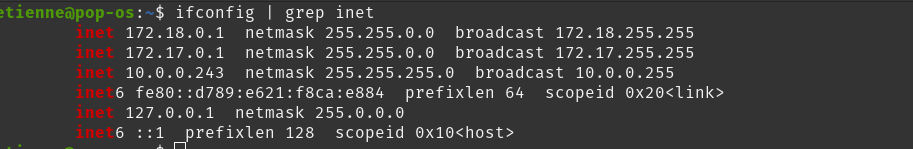

<br>

**Données recueillis**

<table>
  <tr>
    <th></th>
    <th></th>
  </tr>
  <tr>
    <td>IP courrant</td>
  </tr>
  <tr>
    <td>10.0.0.243</td>
  </tr>
</table>

<br>
<br>

Maintenant, nous pouvons obtenir à partir de l'adresse ip l'intervalle du network en exécutant:


```shell
ipcalc 10.0.0.243
```

**Résultat**

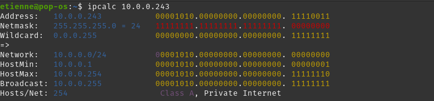

<br>

**Données recueillis**

<table>
  <tr>
    <th></th>
    <th></th>
  </tr>
  <tr>
    <td>IP courrant</td>
    <td>Intervalle network</td>
  </tr>
  <tr>
    <td>10.0.0.243</td>
    <td>10.0.0.0/24</td>
  </tr>
</table>

<br>
<br>


### Scan le network

Il est désormais possible de scanner tout les appareils ce retrouvant dans le network ayant le port ssh utilisé (22) et ouvert.

```shell
sudo nmap 10.0.0.0/24 -p 22 --open
```

**Résultat**


<br>
<br>


**Données recueillis**

<table>
  <tr>
    <th></th>
    <th></th>
  </tr>
  <tr>
    <td>IP courrant</td>
    <td>Intervalle network</td>
    <td>IP machines</td>
  </tr>
  <tr>
    <td>10.0.0.243</td>
    <td>10.0.0.0/24</td>
    <td>10.0.0.33</td>
  </tr>
    <tr>
    <td></td>
    <td></td>
    <td>10.0.0.243</td>
  </tr>
</table>

<br>
<br>

L'adresse qui nous intéresse ici est le <po>10.0.0.33</po>, car c'est sur cette adresse que nous effecturons une attack de type brute force.

<br>

### Attaque brute force

Pour effectué une attaque brute force, nous devons d'abord construire deux fichiers. Un sera en charge de contenir une énumération de mot de passe et l'autre celles des noms d'utilisateurs. Elles seront ensuite combiner pour accomplire le brute force sur toute les combinaisons possibles. Ainsi, un fichiers plus gros aura pour effet de prendre plus de temps à brute force. 

> Une liste de mot de passe assez garnis serait d'utilisé [Rockyou.txt](https://github.com/brannondorsey/naive-hashcat/releases/download/data/rockyou.txt). Cependant, avoir recours à cette liste viendrait ajouter un temps considérable au test. Ainsi, nous allons nous limiter à quelques. options.

<br>

**users.txt**
#### Contient une liste de nom d'utilisateur potentiel.
Contenu
```txt
wow
root
toor
sudo
who
etienne
gandalf
```

**passwords.txt**
#### Contient une liste de mot de passe potentiel.
Contenu
```txt
po
allo
123
allopo
bella
```

Pour effectué une attaque brute force, nous devons exécuter:

```shell
sudo nmap 10.0.0.33 -p 22 --script ssh-brute --script-args userdb=users.txt,passdb=passwords.txt
```

**Résultat**

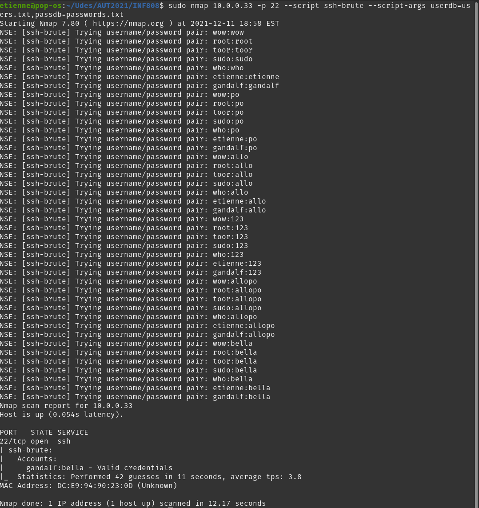

<br>

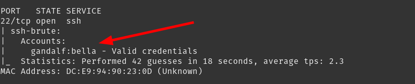

<br>

La photo précédante illustre que nous avons belle et bien trouver une correspondance entre le nom d'utilisateur **gandalf** et le mot de passe **bella**.  D'ailleurs, il est possible d'effectuer une attaque brute force d'une autre façon. En effet, il est possible d'utilisé <po>hydra</po> qui ce voit être plus rapide.
 
<br>

Pour utilisé hydra, exécuter:

```shell
sudo hydra -L users.txt -P passwords.txt ssh://10.0.0.33 -t 8
```

**Résultat**

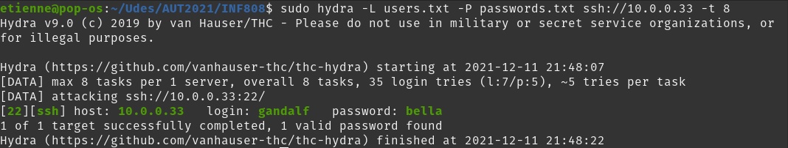

<br>


<br>

Dans cette situation, nous conservons la même conclusion. C'est à dire, que le nom d'utilisateur **gandalf** et le mot de passe **bella** concorde ensemble.

<br>

Nous venons d'avoir la confirmation qu'avoir recours à l'authentification par utilisateur plutôt que par clef ssh est hautement risqué. Certes, les mots de passe étaient cours dans l'exemple. Toutefois, nous avons opté pour ce choix dans un contexte de démonstration. Un mot de passe plus compliqué peut éventuellement être brute forcé dépendamment du temps, des ressources et de l'intérêt que dispose l'attaquant. 

<br>

Le modèle de sécurité que nous avons présenté permet de contré ce type d'attaque en bloquant toutes demandes de connections sans clef ssh.

##### Conséquences de l'utilisation du brute force après notre modèle appliqué
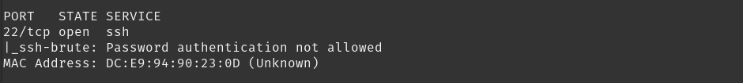

<br>

Le brute force n'en reste pas moins impossible. Toutefois, il est vraiment plus difficle dans tiré profit dans un contexte ou le server accept uniquement les connection par clef ssh en plus d'un passphrase. En effet, brute force une clef rsa de 4096 bit n'est pas impossible, mais il devient extrêmement non trivial de réussir un tel exploit. D'autant plus que dans un contexte de home server, il n'est pas **commun** de voir ce genre de tentative.

<br>

## Pour aller plus loin
- [ ] mettre en place une attaque dos
- [ ] créer un script regrouppant les différentes configuration mentionné afin d'automatiser la sécurisation du serveur
- [ ] tester SSHGuard, Fail2ban and DenyHosts pour contrer les attaque par force brute

<br>

## Référence

[Désactivé la connexion root SSH](https://www.ionos.fr/assistance/serveurs-et-cloud/premiers-pas/informations-importantes-sur-la-securite-de-votre-serveur/desactiver-la-connexion-root-ssh/)
[Qu'est-ce qu'une clé SSH](https://help.gnome.org/users/seahorse/stable/about-ssh.html.fr#:~:text=L'avantage%20d'utiliser%20une,et%20un%20mot%20de%20passe.)
[schéma d'authentification SSH](https://spectralops.io/blog/guide-to-ssh-keys-in-gitlab/)