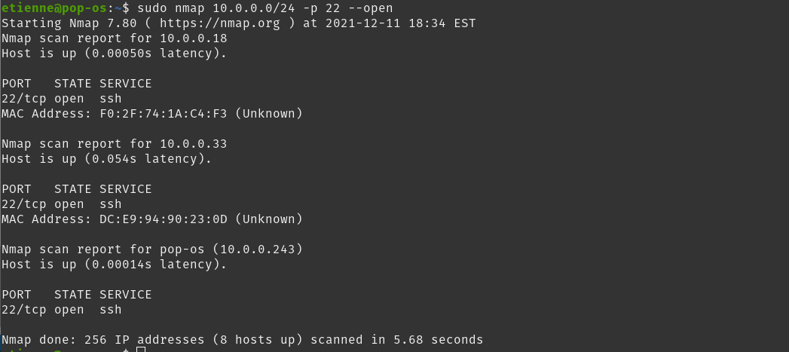

<!-- @import "note-style.less" -->

<!-- https://detexify.kirelabs.org/classify.html -->
<!-- https://shd101wyy.github.io/markdown-preview-enhanced/#/ -->

<link href="https://fonts.googleapis.com/css2?family=Handlee&display=swap" rel="stylesheet">

<!--

<table>
  <tr>
    <th></th>
    <th></th>
  </tr>
  <tr>
    <td></td>
    <td></td>
  </tr>
  <tr>
    <td></td>
    <td></td>
  </tr>
</table>

<table>
  <td></td>
  <td></td>
</table>

brute force + list leak

firewall

mettre devant un vpn

art


### Introduction

* Pourquoi avoir un home server?
  * Centralise et fournit un control absolue sur les données et traitements
  * Hybride : peut faire d'autre tâche que son objectif premier
  * Pleine gestion sur la disponibilité du server
  * Gestion des sauvegardes
  * Potentiel maintient de la privacité des données
* Dois-je réellement sécurisé mon home server?
  * Si port forward -> alors oui
* Type de server qui demande à être plus sécuritaire

> Il y a plusieurs façon de sécurisé un home server. Nous couvrirons uniquement ceux que nous jugeons pertinante et intéressante dans le cadre du cours. Aussi, les pratiques mises de l'avant diminue le risque d'intrusion sans pour autant les éliminer à 100%.

> La nonchalance de permettre des connections non autorisés au server n'est pas une mesure de sécurité.

<br>
<br>

### État art

* SSH
  * Permet d'avoir un accès shell crypté au server
* VPN
  * Permet d'avoir accès a un network qui autrement n'aurait pas été possible
* Firewall
* Fail2ban 


<br>
<br>

### Implementation

* SSH
  * 


* SSH + VPN
  * 

> On ne veut pas éviter le problèmes mais le gérer. Ainsi, on à la situation où on concerve uniquement le ssh et l'autre qui à le ssh et le vpn.

> On ne peut pas accepter uniquement la connection provenant de certain ip

> Ne pas exposer le machines ssh directement sur internet


-->

# Home Server

Étienne Gauvin-Clermont (18 094 321)
Michael Labrecque (18 135 643)

<br>

## Mise en situation

De nos jours, il devient de plus en plus intéressant de vouloir ce confectionner un serveur maison (home server), et ce, pour plusieurs raisons. Pour en citer quelques une :

* Centralise et fournit un contrôle absolu sur les données et traitements 
* Hybride : peut faire d'autres tâches que son objectif premier

<block-text> **Exemple** 
Prenons un home server dont son principal objectif est le stockage d'informations. On peut lui demander parallèlement d'exécuter d'autres tâches. En effet, nous pouvons lui demander par exemple d'encoder des vidéos avec ffmpeg, mettre en place un serveur pour un jeu, faire de l'interpolation de vidéo avec [RIFE](https://github.com/hzwer/arXiv2020-RIFE).
</block-text>

* Pleine gestion sur la disponibilité du serveur
* Gestion des sauvegardes
* **Potentiel** maintien de la privacité des données

<br>

Dans la situation où un serveur est utilisé uniquement à des fins personnelles et de façon locale, il est tout à fait acceptable de limiter son implication dans le but de sécuriser pleinement celui-ci. Toutefois, il peut être intéressant de rendre accessible notre serveur de l'extérieur (remote access). Ainsi, il serait désormais possible de consulter et interagir avec notre serveur de n'importe qu'elle endroit. Pour ce faire, il suffit de port forward le serveur. Une telle configuration est très triviale, mais elle à un problème.

<br>

Le problème est que port forward notre serveur nous rend plus propice aux attaques. Effectivement, rendre notre système interrogeable de l'extérieure pour nous le rend aussi pour les autres. Pour cette raison, nous devons mettre certains concepts en place pour limiter le plus possible une future tentative d'intrusion.

> Il y a plusieurs façons de sécuriser un home server. Nous couvrirons uniquement ceux que nous jugeons pertinents et intéressants dans le cadre du cours. Aussi, les pratiques mises de l'avant diminuent le risque d'intrusion sans pour autant les éliminer à 100%.

<br>

Ce document va illustrer certaines configurations que nous avons testées et mises en place. D'ailleurs, certaines de ces configurations ont été automatisées dans un projet typescript que nous avons développé et mis disponible sur [GitHub](https://github.com/MYSTACK555/SEC_SEARCH). Son comportement reste limité, mais ça structure est faite de sorte à être très propice à l'ajout de configuration. 

<br>

## Modèle de sécurité

Sachant que notre serveur peut être accessible ou interrogé par n'importe qui sur internet, nous avons l'obligation de mettre en place certaines mesures de sécurité afin de protéger nos données.

<br>

### Activer firewall

**Prérequis**

```shell
sudo apt install ufw
```


Pour activer le firewall, exécuter:

```shell
sudo ufw enable
```

Ensuite, nous devons autoriser le port SSH (par défaut 22) dans le firewall en exécutant:

```shell
sudo ufw allow 22/tcp 
```

> Il est parfois nécessaire d'incorporer un fichier de configuration dans <po>/etc/ufw/applications.d</po> pour ajouter des règles détaillées.

Exemple de règle pour un [Plex](https://www.plex.tv/en-ca/)

```shell

[plexmediaserver]
title=Plex Media Server (Standard)
description=The Plex Media Server
ports=32400/tcp|3005/tcp|5353/udp|8324/tcp|32410:32414/udp

[plexmediaserver-dlna]
title=Plex Media Server (DLNA)
description=The Plex Media Server (additional DLNA capability only)
ports=1900/udp|32469/tcp

[plexmediaserver-all]
title=Plex Media Server (Standard + DLNA)
description=The Plex Media Server (with additional DLNA capability)
ports=32400/tcp|3005/tcp|5353/udp|8324/tcp|32410:32414/udp|1900/udp|32469/tcp

```

> C'est une bonne pratique de séparer les règles dans plusieurs fichiers. Par exemple, les règles précédentes pourraient être contenues dans un fichier <po>PlexMediaServer</po>

Ensuite, il suffit d'activer certaines règles par leur nom. Par exemple:
```shell
sudo allow plexmediaserver-all
```

> Un *reload* est parfois nécessaire pour prendre en considération certaines modifications. `sudo ufw reload`

<br>

### Désactiver le root login

L'une des premières étapes dans la sécurisation d'un serveur est de désactiver l'accès à celui-ci de l'extérieur avec le compte de super utilisateur. Comme l'une des méthodes d'accès via un terminal est SSH, nous devons d'abord désactivé la connexion à la machine depuis l'utilisateur root.

<br>

Quelques raisons pour lesquelles il est préférable de désactiver cet utilisateur :
* Il possède énormément trop de droits sur la machine. (Il possède tous les droits)
* Même avec un mot de passe relativement fort il reste vulnérable à une attaque par force brute.

<br>

<block-title>Étapes </block-title>

1. Ouvrir le fichier de configuration sshd_config
  
  ```bash
  nano /etc/ssh/sshd_config
  ```

2. Chercher la ligne **`PermitRootLogin yes`** et remplacer la valeur `yes` par `no`
3. Sauvegarder le fichier
4. Redémarrer le service SSH
  
  ```bash
    service ssh restart
  ```

<br>

### Utiliser clef SSH plutôt qu'un mot de passe

Comme nous allons nous connecter à notre serveur exposé depuis un réseau qui n'est pas sécurisé, l'utilisation d'une clé Sécure shell nous permettra de créer une connexion sécurisée. La clé SSH utilise de la cryptographie à clé publique. C'est un algorithme composé de deux clés. Une clé publique mise à la disponibilité de tous et une clé privée bien gardée sur la machine du client qui sert à déchiffrer les messages chiffrés à l'aide de la clé publique correspondante.
<br>

Il existe plusieurs algorithmes permettant de créer une paire de clés SSH :
<table>
  <tr>
    <th></th>
    <th></th>
  </tr>
  <tr>
    <td>DSA</td>
    <td>RSA</td>
    <td>Ed25519</td>
  </tr>
  <tr>
    <td>Dangereux et plus utilisé depuis la version 7.0 de OpenSSH</td>
    <td>Offrant une sécurité acceptable si la longueur de la clé est de 3072 ou 4096 bits</td>
    <td>L'algorithme à privilégier de nos jours, car actuellement le plus sûr.</td>
  </tr>
</table>

<br>
<br>

L'utilisation d'une phrase secrète pour protéger la clé privée est une excellente façon de s'assurer que nous sommes la seule personne qui puisse l'utiliser principalement si nous ne sommes pas le seul utilisateur de la machine. De plus, cela ajoute une étape supplémentaire à un attaquant qui réussirait à prendre possession de la clé privée puisqu'il devra faire une attaque par force brute afin de trouver cette phrase avant d'utiliser la clé privée.

<br>

Afin de s'authentifier au serveur avec sa clé ssh, le client procède comme suit:

1. Le client initialise la connexion ssh
2. Le serveur génère un message aléatoire <a name="po1"></a>
3. Le client encrypte le message aléatoire avec sa clé privée
4. Le serveur décrypte le message encrypté avec la clé publique du client
5. Dans le cas où le message décrypté est le même que celui initialement envoyé au client, le serveur envoie une réponse affirmative au client
6. Le client et le serveur s'entendent sur l'utilisation d'une clé de session
7. Échange de données encrypté avec un algorithme symétrique et la clé de session


<div style="page-break-after: always;"></div>

<block-text> **Étapes** 
Créer clef client
</block-title>

Afin de générer une clé, il suffit de procéder comme suit :

1. Ouvrir un terminal
2. Générer la clé avec la commande 
   * Pour Ed25519
    `ssh-keygen -t ed25519`
   * Pour RSA
    `ssh-keygen -t rsa -b 4096`
3. Laisser l'emplacement par défaut
4. Entrez une phrase secrète pour protéger la clé privée

<br>

Cela peut être intéressant d'avoir plusieurs clefs ssh, car on peut plus facilement gérer les restrictions et l'utilisation de ceux-ci. En effet, il pourrait arriver la situation où nous voulons désactiver/invalider une certaine clef en plus de savoir exactement quelle clef a été utilisée à quel moment.

<br>

Pour créer une clef RSA de 4096 bits portant le nom de client, exécuter:
```shell
ssh-keygen -t rsa -b 4096 -f ~/.ssh/client-key
```

> Le nom *client* aurait pu être remplacé par n'importe quoi.

Il sera proposé lors de la création de la clef de fournir un passphrase. Il est fortement conseillé de fournir un passphrase, sans quoi seule la possession de la clef privée (client-key) sera nécessaire pour l'authentification.

<br>

Après, le dossier */home/username/.ssh* contient les fichiers suivants :
* client-key
* client-key.pub

<br>

**Résultat**


<div style="page-break-after: always;"></div>

<block-text> **Étapes** 
Transférer clef client au serveur
</block-title>

Pour copier la clef publique du client vers le serveur, exécuter:
```shell
cat ~/.ssh/client-key.pub | ssh server_username@server_ip "mkdir -p ~/.ssh && cat >> ~/.ssh/authorized_keys"
```

> Remplacer *server_username* avec le nom du serveur et remplacer *server_ip* par l'ip du serveur.

Maintenant, le dossier du serveur */home/username/.ssh* contient le fichier <po>authorized_keys</po>


<br>

<block-text> **Étapes** 
Connexion au serveur
</block-title>

Pour se connecter au serveur, exécuter:
```shell
ssh -i ~/.ssh/client-key server_username@server_ip
```

> Remplacer *server_username* avec le nom du serveur et remplacer *server_ip* par l'ip du serveur.

Ensuite, il faudra saisir le passphrase entré dans les étapes précédentes.


<br>

Toutefois, nous sommes toujours en mesure de nous connecter au serveur par le biais des informations d'un utilisateur. En effet, l'ajout d'une clef publique au serveur n'empêche pas automatiquement l'authentification par mot de passe.


<div style="page-break-after: always;"></div>

### Authentification uniquement par la clef SSH </block-title>

Il est maintenant primordial de vouloir empêcher toute authentification avec le mot de passe de l'utilisateur. Pour refuser une connexion ssh utilisant ce principe, il suffit de modifier le fichier <po>/etc/ssh/sshd_config</po> pour y ajouter cette ligne :

```shell
PasswordAuthentication no
```

Ensuite, il sera impossible de se connecter avec un mot de passe d'utilisateur.


<br>

### Ajouter un système MFA à la connexion SSH

L'utilisation d'un mot de passe ou la clé SSH sont 2 facteurs d'authentification différents. Un facteur d'authentification est une information utilisée afin de prouver que l'utilisateur a le droit d'effectuer des actions sur un système tel que de s'y connecter. Ces facteurs utilisent différents canaux d'authentification tels qu'un ordinateur, un téléphone cellulaire ou une clé physique d'authentification. C'est le média qui sert à transmettre un facteur d'authentification à l'utilisateur. Afin de renforcer la connexion ssh à notre serveur, c'est une bonne pratique d'appliquer une sécurité supplémentaire par l'utilisation de MFA (Multi-factor authentification). De cette façon, un attaquant qui réussit à compromettre votre ordinateur de bureau doit aussi obtenir le contrôle d'un ou plusieurs autres appareils vous appartenant afin de pouvoir effectuer ses actions malicieuses.

<br>

Les types de facteurs se catégorisent en 3 groupes:
* Quelque chose que vous connaissez: un mot de passe ou une question de sécurité
* Quelque chose que vous possédez: une application d'authentification ou un token de sécurité.
* Quelque chose propre à vous: une empreinte digitale, ou la reconnaissance vocale

<br>

L'un des facteurs fréquemment utilisés par les différents systèmes est une application OATH_TOTP (Open Authentication Time-Based One-Time Password). OATH_TOTP est un protocole utilisant un mot de passe généralement composé de 6 à 8 caractères utilisables une seule fois et qui se rafraichit après une période de temps d'environ 30 secondes. Un exemple de ces applications serait Google authenticator ou Microsoft authenticator. Un tel système peut être configuré de la façon suivante.


<block-text> **Étapes** 
Installer Google PAM
</block-title>

   * Installer l'application
  `sudo apt install libpam-google-authenticator`
   * Lancer l'application
  `google-authenticator`
   * Répondre 'y' à la question `Do you want authentication tokens to be time-based (y/n)`
   * Répondre 'y' à la question 
   `Do you want to disallow multiple uses of the same authentication
token? This restricts you to one login about every 30s, but it increases
your chances to notice or even prevent man-in-the-middle attacks (y/n)`
   * Répondre 'n' à la question
   `By default, tokens are good for 30 seconds and in order to compensate for
possible time-skew between the client and the server, we allow an extra
token before and after the current time. If you experience problems with poor
time synchronization, you can increase the window from its default
size of 1:30min to about 4min. Do you want to do so (y/n)`
   * Répondre 'y' à la question
  `If the computer that you are logging into isn't hardened against brute-force
login attempts, you can enable rate-limiting for the authentication module.
By default, this limits attackers to no more than 3 login attempts every 30s.
Do you want to enable rate-limiting (y/n)`

<br>

<block-text> **Étapes** 
Configurer Pam pour OpenSSH
</block-title>

 * Ouvrir la configuration sshd avec votre éditeur préféré
`sudo nano /etc/pam.d/sshd`
 * Commenter la ligne `include common-auth` au début du fichier avec le caractère **#**
    > Cela informe PAM de ne pas demander pour un mot de passe, mais seulement pour la vérification du second facteur. Laisser la ligne non commentée utilise 3 facteurs (la clé ssh, le mot de passe du compte, la vérification du TOTP)
 * Ajouter la ligne `auth required pam_google_authenticator.so nullok` à la toute fin du fichier
   > nullok signifie que la méthode d'authentification PAM est optionnel. Cela permet à un utilisateur sans jeton OATH-TOTP de se tout de même se connecter via ssh.
   **Important**: Retirer la valeur nullok lorsque tous les utilisateurs ont configuré leur jeton OATH-TOTP
 * Sauvegarder et fermer

<br>

<block-text> **Étapes** 
Configurer ssh pour qu'il gère l'authentification PAM
</block-title>

* ouvrir le fichier `/etc/ssh/sshd_config` dans votre éditeur préféré
`sudo nano /etc/ssh/sshd_config`
* Trouver le paramètre `ChallengeResponseAuthentication` et assigner la valeur yes
* Ajouter la ligne suivante
`AuthenticationMethods publickey,password publickey,keyboard-interactive`
* Sauvegarder et fermer le fichier
* Redémarrer le service sshd
`sudo systemctl restart sshd.service`

<br>


### Configuré un intervalle de délais d'inactivité


Cela permet de fermer une connexion ssh qui n'est plus utilisé. Cela évite de consommer inutilement des ressources système tout en évitant qu'une personne tierce puisse accéder à la connexion en accédant à l'ordinateur de l'utilisateur connecté. Pour cela, il suffit de :

1. Ouvrir le fichier sshd_config avec votre éditeur préféré
`sudo nano /etc/ssh/sshd_config`
2. Décommenter et attribué la valeur désirée en seconde 300 (5min) à la variable **ClientAliveInterval**
3. Sauvegarder et fermer
4. Relancer le service
`sudo systemctl restart sshd.service`

<br>

### Changer le port SSH par un personnalisé

Le port utilisé par défaut est le 22. Cette valeur est largement connue au sein des attaquants. Les différents outils de sécurité et d'intrusion utilisent donc principalement ce port. Même si le modifier revient à faire de la sécurité par l'ignorance qui est très faible comme sécurité, cela permettra néanmoins de réduire considérablement les attaques automatisées sur le port SSH

1. Ouvrir le fichier sshd_config avec votre éditeur préféré
`sudo nano /etc/ssh/sshd_config`
2. Décommenter et attribué la valeur désirer ex. 500 à la variable **Port**
3. Sauvegarder et fermer
4. Relancer le service
`sudo systemctl restart sshd.service`
> Ne pas oublier de modifier le transfert des ports sur le routeur pour la même valeur.


<div style="page-break-after: always;"></div>


### Désactivé le transfer X11

Premièrement, c'est inutile pour un serveur qui est dans 99.9% des cas utilisé avec un terminal. Ensuite, cela empêchera certains vecteurs d'attaque qui exploite le transfert X11 qui n'a pas été conçu en ayant la sécurité comme point fort lors du développement. Le fait qu'il soit activé n'est pas mauvais dans le cas où le serveur n'est pas compromis. Le transfert X11 amène une plus grande confiance du côté serveur qu'à celui du client. S'il a été compromis, il peut servir à effectuer une multitude d'actions sur la machine du client tel qu'ouvrir ou fermer des fenêtres et espionner les touches saisies et injecter des événements clavier ou sourie. En le désactivant, nous évitons un potentiel vecteur de propagation d'un malware sur la machine client depuis notre serveur.

<br>

Pour cela, il suffit de :

1. Ouvrir le fichier sshd_config avec votre éditeur préféré
`sudo nano /etc/ssh/sshd_config`
2. Changer la valeur pour **no** à la variable **X11Forwarding**
3. Sauvegarder et fermer
4. Relancer le service
`sudo systemctl restart sshd.service`

<br>

## Attaque pouvant être menée sur un home server
Tous serveurs peuvent être la cible d'attaque principalement lorsque les services sont exposés sur le web. Parmi celles-ci on peut retrouver les attaques Man-in-the-Middle, le deni de service, brute force des identifiants du port ssh. Certaines sont plus faciles à contrer que d'autres.

<br>

### Man-in-the-Middle
Cette attaque, comme son nom l'indique, met en place un acteur malveillant entre nous et la machine/service que l'on veut joindre. Le but est d'intercepter les communications échangées entre les deux entités sans que sa présence ne soit remarquée. Dans ce type d'attaque, l'homme du milieu peut lire, mais aussi modifier les messages échangés. Le protocole de la connexion SSH avec une clé ssh permet de se prémunir contre cette attaque. En effet, dans le cas où un utilisateur nommé Ève tenterait de se mettre entre l'utilisateur Alice et le serveur de Bob, Ève pourrait tenter d'initier la connexion avec Bob à la place d'Alice et se faire passer pour le serveur de Bob auprès d'Alice. Cependant, Ève ne réussirait pas à joindre le serveur de Bob puisqu'elle ne réussirait pas à passer l'étape de l'encryption du mot généré aléatoirement [à l'étape 2](#po1), car sa clé ssh public n'est pas sauvegardé dans le serveur de Bob. Ainsi, lorsque Bob tenterait de décoder le message reçu par Ève, celui-ci ne correspondrait pas au mot qu'il a initialement envoyé et la connexion serait abandonnée.

<br>

### Attaque par déni de service (DOS)
C'est une attaque qui vise à rendre un système indisponible et elle peut prendre différentes formes. Par exemple, la saturation de la bande passante qui rend ainsi le serveur injoignable et même l'épuisement des ressources système de la machine qui l'empêche de répondre au trafic légitime. Le déni de service opère  par l'envoi d'une multitude de requêtes rapidement sur la machine visée afin de rendre le service instable voir indisponible. Cette attaque est la plus difficile à mitiger pour un home serveur puisque même si des règles de pare-feu sont appliquer et bloque les connexions malicieuses. Les demandes de connexion peuvent tout de même arriver en grande quantité et saturer la bande passante. La solution la plus probable dans ce cas est que le fournisseur d'accès internet bloque les requêtes faites vers le home server. Plusieurs services existent afin de mitiger au maximum ce type d'attaque. Parmis eux on trouve SSHGuard, Fail2ban and DenyHosts. Aucun d'eux n'a été testé ici.

<br>

### Brute force SSH

**Prérequis**

```shell
sudo apt install ipcalc
sudo apt install nmap
sudo apt-get install -y hydra
```

> Les paquets précédents doivent être installé pour réaliser la totalité du brute force.

Comme nous avons mentionné, il est tout à fait réaliste d'imaginer une situation où des tentatives de connexions seront faites sur notre serveur pour causer préjudice. Cette section va tenter de mettre en évidence l'importance des précautions proposées dans les sections précédentes.

> Nous allons faire abstraction sur les moyens utilisés par un individu pour se connecter avec succès au network qui occupe notre machine qui sera brute force.

Sachant qu'une personne mal intentionnée réussie à ce connecter au network, celui-ci peut tenter de brute force les machines ayant un service ssh. Pour réussir ce tour de force, il va falloir qu'il trouve l'ip de toutes les machines ayant un service ssh activer en effectuant un network map scan. Pour effectué un network map scan, il faut d'abord avoir l'intervalle du network.

<br>

### Obtenir network informations

Pour obtenir cet intervalle, il faut d'abord connaitre l'ip courant de la machine en exécutant:

```shell
ifconfig | grep inet
```

**Résultat**


<br>

**Données recueillies**

<table>
  <tr>
    <th></th>
    <th></th>
  </tr>
  <tr>
    <td>IP courrant</td>
  </tr>
  <tr>
    <td>10.0.0.243</td>
  </tr>
</table>

<br>
<br>

Maintenant, nous pouvons obtenir à partir de l'adresse ip l'intervalle du network en exécutant:


```shell
ipcalc 10.0.0.243
```

**Résultat**


<br>

**Données recueillis**

<table>
  <tr>
    <th></th>
    <th></th>
  </tr>
  <tr>
    <td>IP courrant</td>
    <td>Intervalle network</td>
  </tr>
  <tr>
    <td>10.0.0.243</td>
    <td>10.0.0.0/24</td>
  </tr>
</table>

<br>
<br>


### Scan le network

Il est désormais possible de scanner tous les appareils se retrouvant dans le network ayant le port ssh utilisé (22) et ouvert.

```shell
sudo nmap 10.0.0.0/24 -p 22 --open
```
<div style="page-break-after: always;"></div>

**Résultat**



<br>
<br>

**Données recueillis**

<table>
  <tr>
    <th></th>
    <th></th>
  </tr>
  <tr>
    <td>IP courrant</td>
    <td>Intervalle network</td>
    <td>IP machines</td>
  </tr>
  <tr>
    <td>10.0.0.243</td>
    <td>10.0.0.0/24</td>
    <td>10.0.0.33</td>
  </tr>
    <tr>
    <td></td>
    <td></td>
    <td>10.0.0.243</td>
  </tr>
</table>

<br>
<br>

L'adresse qui nous intéresse ici est le <po>10.0.0.33</po>, car c'est sur cette adresse que nous effectuerons une attaque de type brute force.

<br>

### Attaque brute force

Pour effectuer une attaque brute force, nous devons d'abord construire deux fichiers. Un sera en charge de contenir une énumération de mots de passe et l'autre celui des noms d'utilisateurs. Elles seront ensuite combinées pour accomplir le brute force sur toutes les combinaisons possibles. Ainsi, un fichier plus gros aura pour effet de prendre plus de temps à brute force. 

> Une liste de mot de passe assez garni serait d'utilisé [Rockyou.txt](https://github.com/brannondorsey/naive-hashcat/releases/download/data/rockyou.txt). Cependant, avoir recours à cette liste viendrait ajouter un temps considérable au test. Ainsi, nous allons nous limiter à quelques. options.

<br>

**users.txt**
#### Contiens une liste de nom d'utilisateur potentiel.
Contenu
```txt
wow
root
toor
sudo
who
etienne
gandalf
```

<div style="page-break-after: always;"></div>

**passwords.txt**
#### Contiens une liste de mot de passe potentiel.
Contenu
```txt
po
allo
123
allopo
bella
```

Pour effectuer, une attaque brute force, nous devons exécuter:

```shell
sudo nmap 10.0.0.33 -p 22 --script ssh-brute --script-args userdb=users.txt,passdb=passwords.txt
```

**Résultat**


<br>


<br>

La photo précédente illustre que nous avons bel et bien trouvé une correspondance entre le nom d'utilisateur gandalf et le mot de passe bella. D'ailleurs, il est possible d'effectuer une attaque brute force d'une autre façon. En effet, il est possible d'utiliser hydra qui se voit être plus rapide.
 
<br>

Pour utiliser hydra, exécuter:

```shell
sudo hydra -L users.txt -P passwords.txt ssh://10.0.0.33 -t 8
```

**Résultat**


<br>


<br>

Dans cette situation, nous conservons la même conclusion. C'est à dire, que le nom d'utilisateur **gandalf** et le mot de passe **bella** concordent ensemble.

<br>

Nous venons d'avoir la confirmation qu'avoir recours à l'authentification par utilisateur plutôt que par clef ssh est hautement risqué. Certes, les mots de passe étaient courts dans l'exemple. Toutefois, nous avons opté pour ce choix dans un contexte de démonstration. Un mot de passe plus compliqué peut éventuellement être brute forcé dépendamment du temps, des ressources et de l'intérêt que dispose l'attaquant. 

<br>

Le modèle de sécurité que nous avons présenté permet de contrer ce type d'attaque en bloquant toutes demandes de connexions sans clef ssh.

##### Conséquences de l'utilisation du brute force après notre modèle appliqué


<br>

Le brute force n'en reste pas moins impossible. Toutefois, il est vraiment plus difficile dans tirer profit dans un contexte où le serveur accepte uniquement les connexions par clef ssh en plus d'un passphrase. En effet, brute force une clef rsa de 4096 bits n'est pas impossible, mais il devient extrêmement non trivial de réussir un tel exploit. D'autant plus que dans un contexte de home serveur, il n'est pas **commun** de voir ce genre de tentative.

<br>

## Pour aller plus loin
- [ ] Mettre en place une attaque dos
- [ ] Créer un script regroupant plus de configurations mentionnées afin d'automatiser la sécurisation du serveur
- [ ] Tester SSHGuard, Fail2ban and DenyHosts pour contrer les attaques par force brute

<div style="page-break-after: always;"></div>

## Références

[Désactivé la connexion root SSH](https://www.ionos.fr/assistance/serveurs-et-cloud/premiers-pas/informations-importantes-sur-la-securite-de-votre-serveur/desactiver-la-connexion-root-ssh/)

<br>

[Qu'est-ce qu'une clé SSH](https://help.gnome.org/users/seahorse/stable/about-ssh.html.fr#:~:text=L'avantage%20d'utiliser%20une,et%20un%20mot%20de%20passe.)

<br>

[Schéma d'authentification SSH](https://spectralops.io/blog/guide-to-ssh-keys-in-gitlab/)

<br>

https://www.reddit.com/r/linux4noobs/comments/9wlqsh/

<br>

https://www.reddit.com/r/admincraft/comments/dw2lq9/how_safe_is_port_forwarding_a_server/

<br>

https://www.digitalocean.com/community/tutorials/how-to-configure-ssh-key-based-authentication-on-a-linux-server

<br>

https://serverfault.com/questions/475468/where-does-ufw-uncomplicated-firewall-save-command-line-rules-to

<br>


https://serverfault.com/questions/850659/securing-linux-servers-iptables-vs-fail2ban

<br>

https://security.stackexchange.com/questions/127092/hardening-linux-desktop-machine-against-people-from-my-household

<br>

https://security.stackexchange.com/questions/25137/what-are-some-steps-to-take-for-securing-a-linux-server-that-arent-in-this-list

<br>

https://serverfault.com/questions/258396/ultra-secure-linux-server-ssh-only/

<br>

https://acloudguru.com/blog/engineering/when-you-should-and-should-not-disable-root-login#:~:text=By%20creating%20a%20user%20with,the%20security%20of%20your%20system.

<br>

https://www.howtogeek.com/443156/the-best-ways-to-secure-your-ssh-server/

<br>

https://www.thegeekdiary.com/how-to-allow-ssh-with-empty-passwords-in-linux/#:~:text=PermitEmptyPasswords%20When%20password%20authentication%20is,accounts%20with%20empty%20password%20strings.&text=But%20if%20we%20set%20the,login%20with%20an%20empty%20password.


<br>

https://www.reddit.com/r/PleX/comments/4lwu9l/server_being_claimed_by_someone_else/d3qrfat/

<br>

https://linuxize.com/post/how-to-setup-a-firewall-with-ufw-on-ubuntu-18-04/

<br>

https://linuxize.com/post/how-to-set-up-ssh-keys-on-ubuntu-20-04/

<br>

https://askubuntu.com/questions/929934/how-can-i-create-multiple-ssh-keys

<br>

https://askubuntu.com/questions/362280/enter-ssh-passphrase-once

<br>

https://askubuntu.com/questions/174981/how-do-i-configure-ufw-to-allow-ssh-on-another-port

<br>

https://security.stackexchange.com/questions/141857/securing-ssh-connections

<br>

https://opensource.com/article/18/9/linux-iptables-firewalld

<br>

https://serverfault.com/questions/774569/how-can-allow-an-ssh-connection-only-over-vpn

<br>

https://dev.to/natterstefan/docker-tip-how-to-get-host-s-ip-address-inside-a-docker-container-5anh#:~:text=On%20Docker%20for%20Linux%2C%20the,you%20are%20using%20default%20networking.
