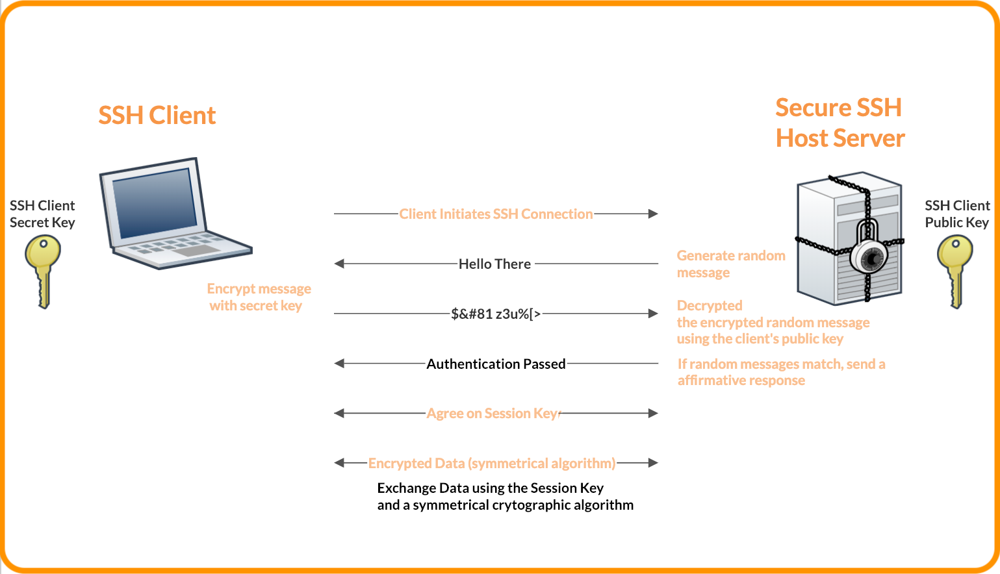
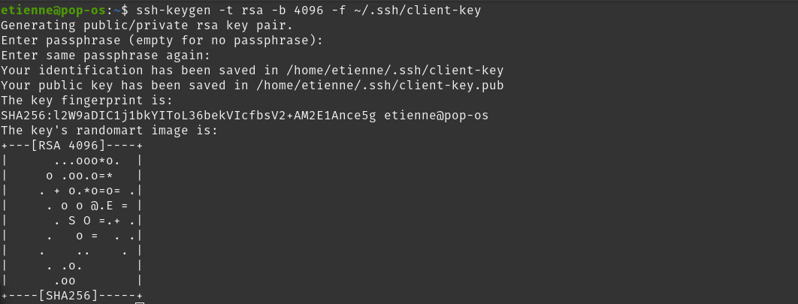
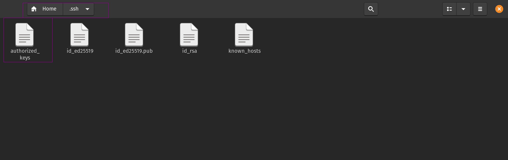
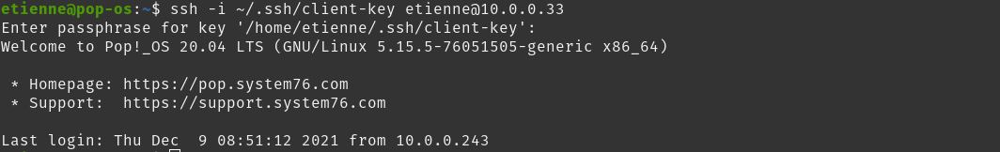
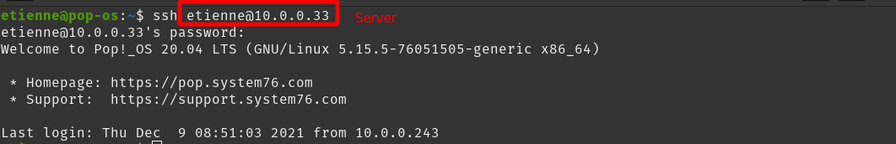

<!-- @import "note-style.less" -->

<!-- https://detexify.kirelabs.org/classify.html -->
<!-- https://shd101wyy.github.io/markdown-preview-enhanced/#/ -->

<link href="https://fonts.googleapis.com/css2?family=Handlee&display=swap" rel="stylesheet">

<!--

<table>
  <tr>
    <th></th>
    <th></th>
  </tr>
  <tr>
    <td></td>
    <td></td>
  </tr>
  <tr>
    <td></td>
    <td></td>
  </tr>
</table>

<table>
  <td></td>
  <td></td>
</table>


-->


# Home Server

Étienne Gauvin-Clermont (18 094 321)
Michael Labrecque (18 135 643)

<br>

## Mise en situation

De nos jour, il devient de plus en plus intéressant de vouloir ce confectionner un server maison (home server), et ce, pour plusieur raisons.

* Centralise et fournit un control absolue sur les données et traitements 
* Hybride : peut faire d'autre tâche que son objectif premier

<block-text> **Exemple** 
Prenons un home server dont son principale objectif est le stockage d'informations. On peut lui demandé parallèlement d'exécuter d'autres tâches. En effet, nous pouvons lui demander par exemple d'encoder des vidéo avec ffmpeg, mettre en place un server pour un jeu, faire de l'interpolation de vidéo avec [RIFE](https://github.com/hzwer/arXiv2020-RIFE).
</block-text>

* Pleine gestion sur la disponibilité du server
* Gestion des sauvegardes
* **Potentiel** maintient de la privacité des données

<br>

Dans la situation où un server est utilisé uniquement à des fins personnel et de façon local, il est tout à fait acceptable de limiter son implication dans le but de sécurer pleinement celui-ci. Toutefois, mettre de l'avant l'idée d'une  il peut être assez intéressant de rendre accessible notre serveur de l'extérieur (remote access). Ainsi, il serait désormais possible de consulter et intéragir avec notre server de n'importe qu'elle endroit. Pour ce faire, il suffit de port forward le server. Une telle configuration est très triviale, mais elle nous rend plus propice aux attaques. Effectivement, rendre notre système interrogable de l'extérieure pour nous le rend aussi pour les autres. Pour cette raison, nous devons mettres certaines concept en place pour limiter le plus possible une future tentative d'intrusion.

> Il y a plusieurs façon de sécurisé un home server. Nous couvrirons uniquement ceux que nous jugeons pertinante et intéressante dans le cadre du cours. Aussi, les pratiques mises de l'avant diminue le risque d'intrusion sans pour autant les éliminer à 100%.

<br>

* Expliquer pourquoi sécurisé un server (port foward ou non), les risques.

* Dans notre situation on a recours a du ssh.

* Pas utilisé par dautre comme dans une compagnie. On a un user.

<br>

## Phase 1

Sachant que notre server peut être accessible ou interrogé par n'importe qui sur internet, nous avons l'obligation de mettre en place certaines mesures de sécurité afin de protéger nos donnés.

<br>

<block-title> Désactiver le root login </block-title>
L'une des premières étapes dans la sécurisation d'un serveur est de désactivé l'accès a celui-ci de l'extérieur avec le compte de super utilisateur. Comme l'une des méthodes d'accès via un terminal est SSH, nous devons d'abort désactivé la connection à la machine depuis l'utilisateur root.
Pour se faire il faut:

1. Ouvrir le fichier de configuration sshd_config
  
  ```bash
  nano /etc/ssh/sshd_config
  ```

2. Chercher la ligne **`PermitRootLogin yes`** et remplacer la valeur `yes` par `no`
3. Sauvegarder le fichier
4. Redémarer le service SSH
  
  ```bash
    service ssh restart
  ```

Les raisons pour lesquelles il est préférable de désactivé cet utlisateur sont:

1. Il possède énormément trop de droit sur la machine. (Il possède tous les droit)
2. Même avec un mot de passe relativment fort il reste vulnérable à une attaque par force brute.

<br>

<block-title> Activer firewall</block-title>

Contrary to popular belief, Lorem Ipsum is not simply random text. It has roots in a piece of classical Latin literature from 45 BC, making it over 2000 years old. Richard McClintock, a Latin professor at Hampden-Sydney College in Virginia, looked up one of the more obscure Latin words, consectetur, from a Lorem Ipsum passage, and going through the cites of the word in classical literature, discovered the undoubtable source. Lorem Ipsum comes from sections 1.10.32 and 1.10.33 of "de Finibus Bonorum et Malorum" (The Extremes of Good and Evil) by Cicero, written in 45 BC. This book is a treatise on the theory of ethics, very popular during the Renaissance. The first line of Lorem Ipsum, "Lorem ipsum dolor sit amet..", comes from a line in section 1.10.32.

<br>

### Rendre SSH plus sécuritaire

<block-title> Utiliser clef SSH plutôt qu'un mot de passe </block-title>

Comme nous allons nous connecter à notre serveur exposé depuis un réseaux qui n'est pas sécurisé l'utilisation d'une clé Sécure shell nous permettera de créer une connection sécurisé. La clé SSH utilise de la cryptographie à clé publique. C'est un algorithme composé de deux clés. Une publique mise à la disponibilité de tous et une privé bien garder sur la machine du client qui sert à déchiffrer les messages chiffrés à l'aide de la clé publique correspondante.

<br>

Il existe plusieurs algorithmes permettant de créer une paire de clé SSH.
<br>

**DSA**
Dangereux et plus utiliser depuis la version 7.0 de OpenSSH

**RSA**
Offrant une sécurité acceptable si la longeur de la clé est de 3072 ou 4096 bits

**Ed25519**
L'algorithme à prévilégier de nos jours, car actuellement le plus sûr.

<br>

Afin de générer une clé il suffit de procédé comme suit:

1. Ouvrir un terminal
2. générer la clé avec la commande 
   * pour Ed25519
    `ssh-keygen -t ed25519`
   * pour RSA
    `ssh-keygen -t rsa -b 4096`
3. Laisser l'emplacement par défaut
4. Entrez une phrase secrète pour protéger la clé privé

<br>

L'utilisation d'une phrase secrète pour protéger la clé privé est une excellente façons de s'assuré que nous sommes la seule personne qui puisse l'utiliser principalement si nous ne sommes pas le seul utilisateur de la machine. De plus, cela ajoute une étape supplémentaire à un attaquant qui réussirait à prendre possession de la clé privé puisqu'il devra faire une attaque par force brute afin de trouvé cette phrase avant d'utiliser la clé privé.

<br>

Afin de s'authentifier au serveur avec sa clé ssh, le client procède comme suit:

1. Le client initialise la connection ssh
2. Le serveur génère un message aléatoire
3. Le client encrypte le message aléatoire avec sa clé privé
4. Le serveur décrypte le message encrypté avec la clé publique du client
5. Dans le cas ou le message décrypté est le même que celui initialement envoyé au client, le serveur envoie une réponse afirmative au client
6. Le client et le serveur s'entende sur l'utilisation d'une clé de session
7. Échange de donné encrypté avec un algorithme symétrique et la clé de session




<br>

### Créer clef client
Pour créer une clef RSA de 4096 bit portant le nom de client, exécuter:
```shell
ssh-keygen -t rsa -b 4096 -f ~/.ssh/client-key
```

> Le nom *client* aurait pu être remplacé par n'importe quoi.

Il sera proposé lors de la création de la clef de fournir un passphrase. Il est fortement conseiller dans fournir un sans quoi seul la possession de la clef privé (client-key) sera nécessaire pour l'authentification.

<br>

Après, le dossier */home/username/.ssh* contient les fichiers suivants :
* client-key
* client-key.pub

<br>

**Résultat**


<br>

### Transférer clef client au server

Pour copier la clef public du client vers le server, exécuter:
```shell
cat ~/.ssh/client-key.pub | ssh server_username@server_ip "mkdir -p ~/.ssh && cat >> ~/.ssh/authorized_keys"
```

> Remplacer *server_username* avec le nom du server et remplacer *server_ip* par l'ip du server.

Maintenant, le dossier du server */home/username/.ssh* contient le fichier <po>authorized_keys</po>



<br>

### Connection au server

Pour ce connecter au server, exécuter:
```shell
ssh -i ~/.ssh/client-key server_username@server_ip
ssh -i ~/.ssh/client-key etienne@10.0.0.33
```


> Remplacer *server_username* avec le nom du server et remplacer *server_ip* par l'ip du server.

Ensuite, il faudra saisir le passphrase entré dans les étapes précédentes.


<br>

Toutefois, nous sommes toujours en mesure de ce connecter au server par le biais des informations d'un utilisateurs. En effet, l'ajout d'une clef public au server n'empêche pas automatiquement l'authentification par mot de passe.



<br>

<block-title> Authentification uniquement par la clef SSH </block-title>

Contrary to popular belief, Lorem Ipsum is not simply random text. It has roots in a piece of classical Latin literature from 45 BC, making it over 2000 years old. Richard McClintock, a Latin professor at Hampden-Sydney College in Virginia, looked up one of the more obscure Latin words, consectetur, from a Lorem Ipsum passage, and going through the cites of the word in classical literature, discovered the undoubtable source. Lorem Ipsum comes from sections 1.10.32 and 1.10.33 of "de Finibus Bonorum et Malorum" (The Extremes of Good and Evil) by Cicero, written in 45 BC. This book is a treatise on the theory of ethics, very popular during the Renaissance. The first line of Lorem Ipsum, "Lorem ipsum dolor sit amet..", comes from a line in section 1.10.32.

<br>

<block-title> Ajouter un two-factor authentication SSH </block-title>

Contrary to popular belief, Lorem Ipsum is not simply random text. It has roots in a piece of classical Latin literature from 45 BC, making it over 2000 years old. Richard McClintock, a Latin professor at Hampden-Sydney College in Virginia, looked up one of the more obscure Latin words, consectetur, from a Lorem Ipsum passage, and going through the cites of the word in classical literature, discovered the undoubtable source. Lorem Ipsum comes from sections 1.10.32 and 1.10.33 of "de Finibus Bonorum et Malorum" (The Extremes of Good and Evil) by Cicero, written in 45 BC. This book is a treatise on the theory of ethics, very popular during the Renaissance. The first line of Lorem Ipsum, "Lorem ipsum dolor sit amet..", comes from a line in section 1.10.32.

<div style="page-break-after: always;"></div>

<br>

<block-title>Référence</block-title>
[Désactivé la connexion root SSH](https://www.ionos.fr/assistance/serveurs-et-cloud/premiers-pas/informations-importantes-sur-la-securite-de-votre-serveur/desactiver-la-connexion-root-ssh/)
[Qu'est-ce qu'une clé SSH](https://help.gnome.org/users/seahorse/stable/about-ssh.html.fr#:~:text=L'avantage%20d'utiliser%20une,et%20un%20mot%20de%20passe.)
[schéma d'authentification SSH](https://spectralops.io/blog/guide-to-ssh-keys-in-gitlab/)